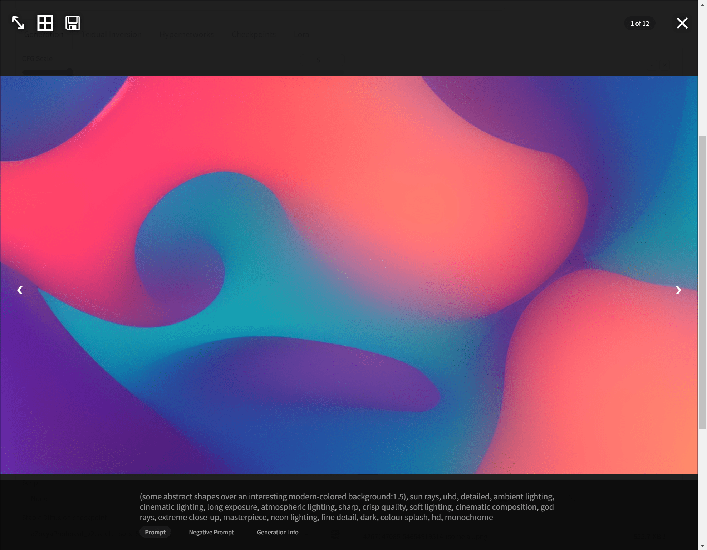
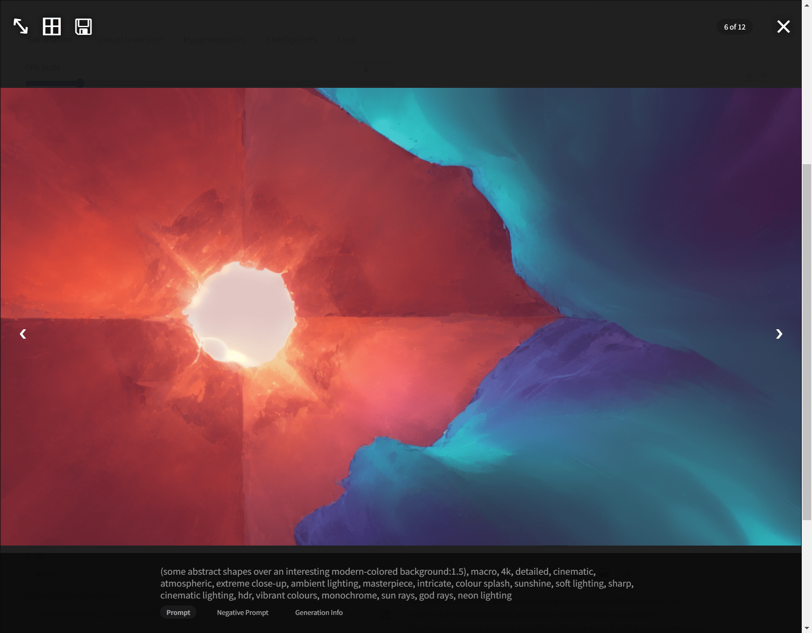
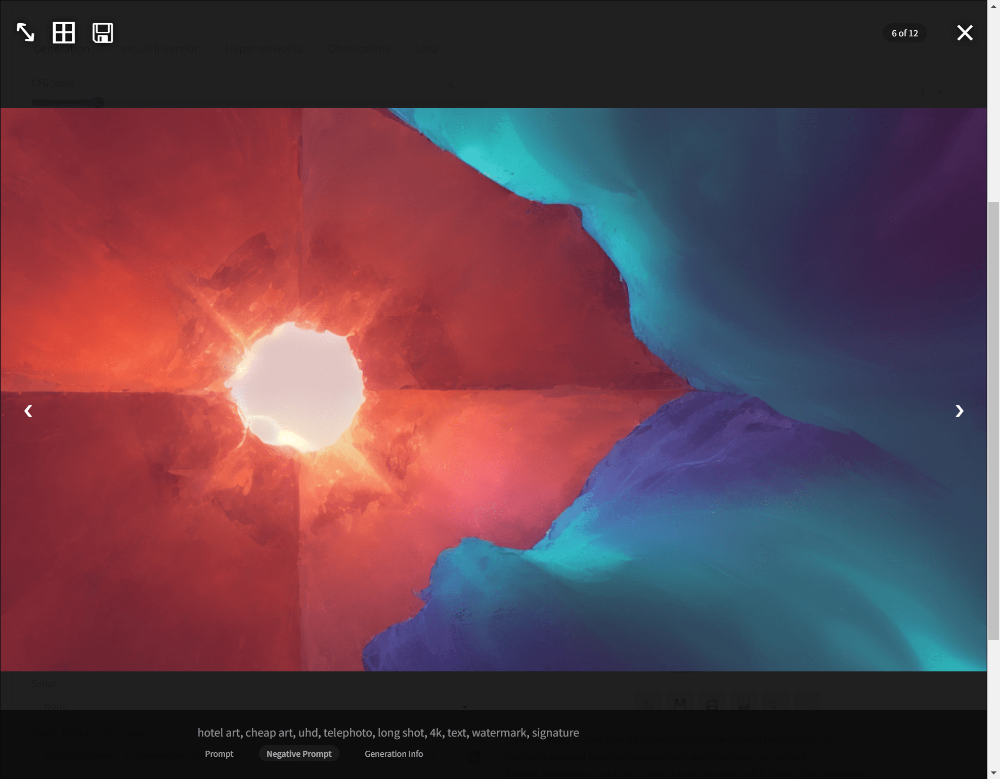
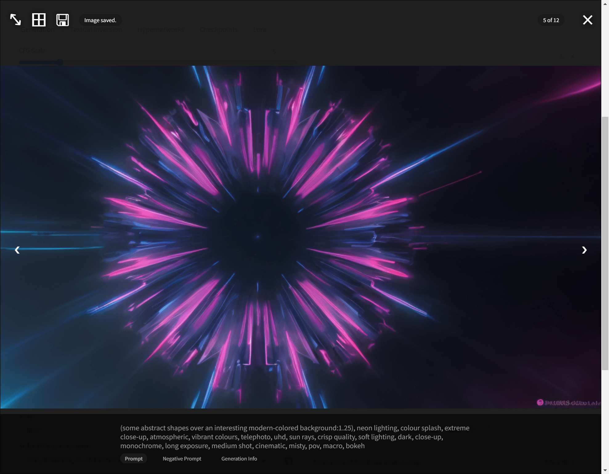
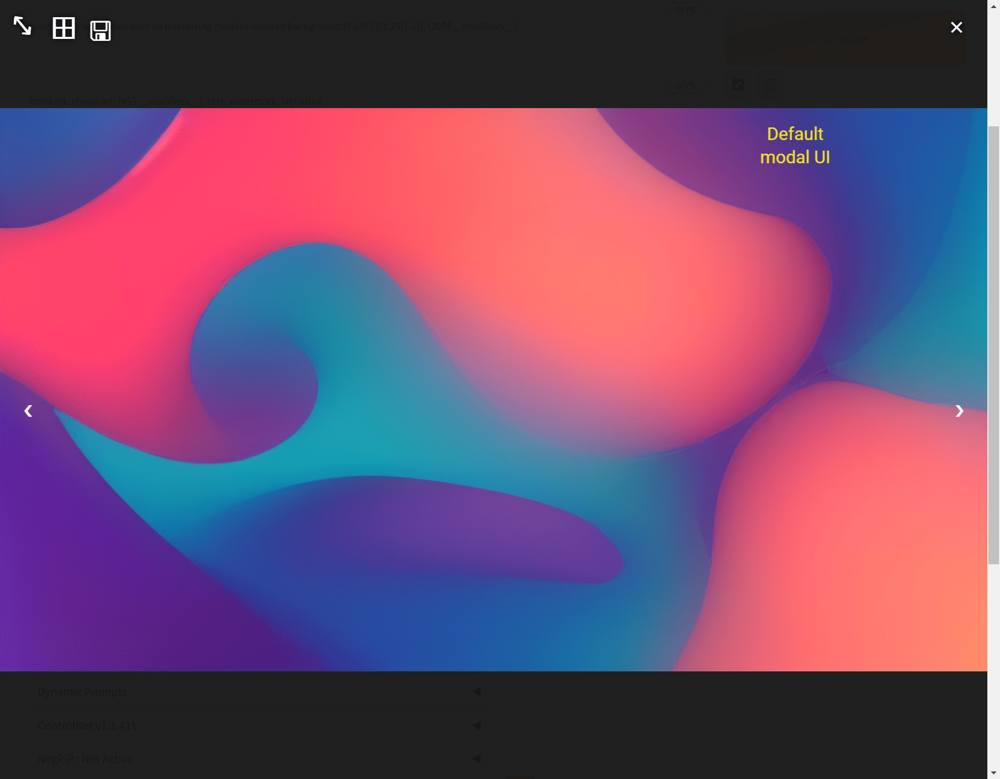
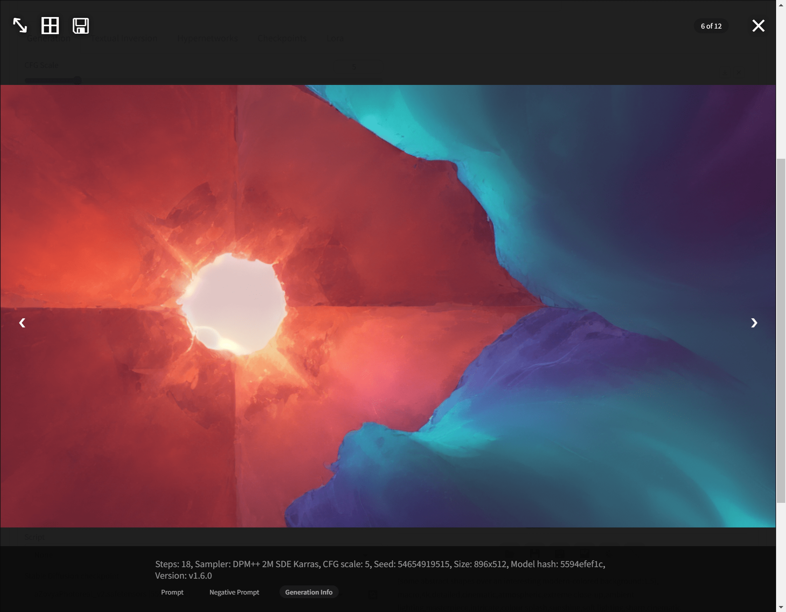

# sd-webui-modal-overlay

## Description

This plugin enhances the existing modal overlay in the [automatic1111 sd-webui](https://github.com/AUTOMATIC1111/stable-diffusion-webui) project. It introduces additional controls and layout improvements, designed to be a minimal yet powerful extension to the current web UI.

## Key Features

### Enhanced Image Viewing 
- Larger default image size within the modal.
- Use the Zoom key to view image at native resolution.

### Prompt Information
   - Users can see prompt information for an image within the modal by simply hovering near the bottom of the window.
   - Separate views for positive prompt, negative prompt, and generation information.

### Keyboard Controls
  - Toggle the prompt view with the `Up Arrow` key.
  - Save images directly from the modal to a pre-configured directory using the `Down Arrow` key. (Saves to directory configured in "Paths for Saving > Directory" in main settings.)
  - Toggle the visibility of the gallery image count with the `G` key.

### Layout Enhancements 
  - Minor layout and button enhancements for a cleaner user interface.

## Installation for Automatic1111 Users

1. Start the `webui.bat`.
2. Navigate to the *Extensions* tab.
3. Click on *Install from URL*.
4. Copy and paste the link to this repository into the *URL for extension's git repository* field.
5. Click *Install*.

## Known Issues

When the total number of images generated (calculated as batch size multiplied by the number of batches) is less than during the previous generation, the application's client-side behavior leads to the deletion of the image preview div. This, in turn, removes the previous thumbnails and disables the modal.

Let me know if you find any other issues.

## License

This project is open-sourced under the MIT License. See the [LICENSE](LICENSE) file for more details.

